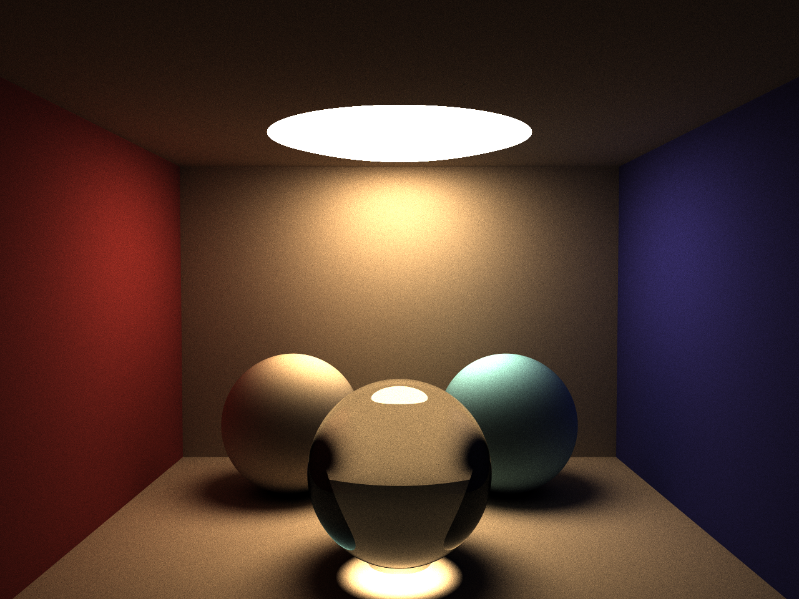
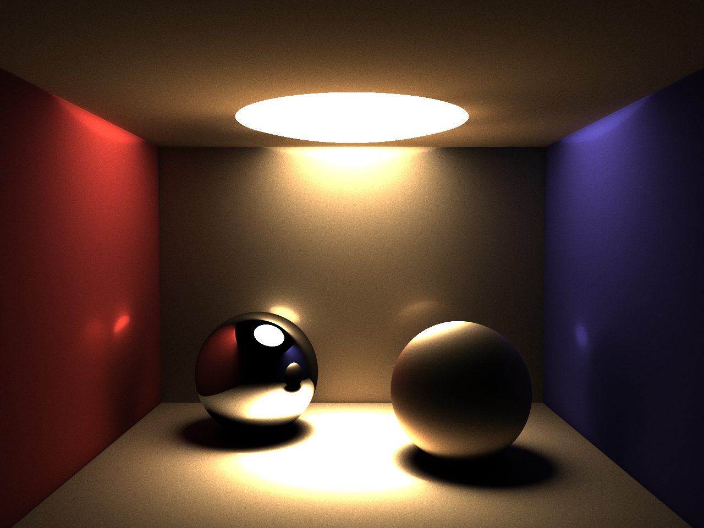

# pathtracer
Pathtracer written in Go

## Description
Simple unidirectional pathtracer written just for fun. 

Supports:
* Spheres and Planes
* Diffuse, transparent or reflective materials
* Movable camera
* Multithreaded rendering and AVX2 accelerated ray transforms

Based on or inspired by:

* My implementation of "The Ray Tracer Challenge" at https://github.com/eriklupander/rt
* Ray in hemisphere code by Hunter Loftis at https://github.com/hunterloftis/pbr/blob/1ce8b1c067eea7cf7298745d6976ba72ff12dd50/pkg/geom/dir.go
* Mask/accumulated color shading by Sam Lapere at https://raytracey.blogspot.com/2016/11/opencl-path-tracing-tutorial-2-path.html

## Gallery

### Image 1

2048 samples, 1280x960, 4 bounces per sample. Took 1h46m to render on MacBook Pro mid 2014.
The transparent sphere reflects 10% av incoming rays and refracts 90%. There seems to be some caustics in play here given the highlight beneath the sphere, although it feels a bit wrong that the caustics isn't visible somehow in the bottom of the sphere?
### Image 2

4096 samples, 1280x960, 3 bounces per sample. Took 2h3m to render on MacBook Pro mid 2014.
The left sphere is 100% reflective.
Note that this image uses a different "ray in hemisphere" implementation that has some kind of cosine-weighted random distribution in the surface normal direction.
